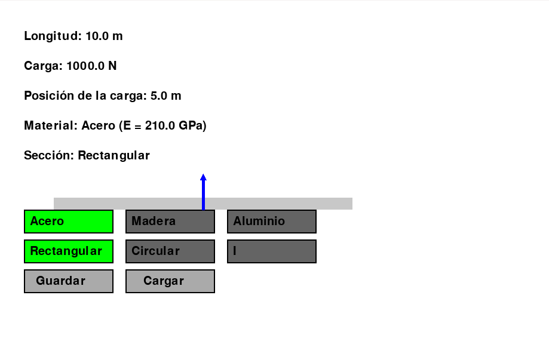
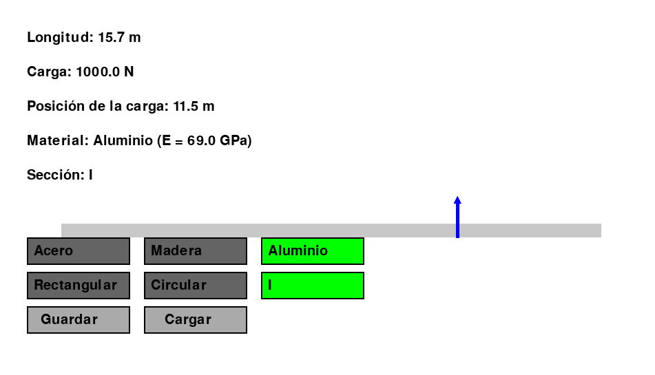
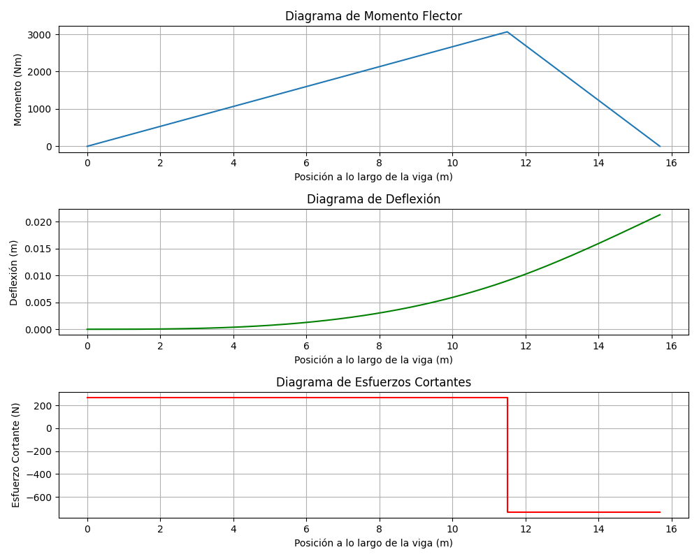

# Simulador de Vigas Interactivo 🏗️

## Descripción

Este proyecto es un **simulador de vigas interactivo** desarrollado en Python utilizando **Pygame** y **Matplotlib**. Permite visualizar y analizar una viga sometida a una carga puntual. Los usuarios pueden interactuar modificando:

- **Longitud de la viga**
- **Posición de la carga**
- **Magnitud de la carga**
- **Tipo de sección transversal**
- **Material de la viga**

El simulador genera diagramas de:

- **Momento Flector**
- **Esfuerzo Cortante**
- **Deflexión**

Esta herramienta está diseñada para estudiantes principiantes en ingeniería de resistencia de materiales que desean comprobar y entender mejor sus cálculos en problemas no resueltos.

## Características Principales

- **Tipos de Cargas:**
  - Carga puntual única.
- **Tipos de Secciones Transversales:**
  - Rectangular
  - Circular
  - Sección en I
- **Materiales Disponibles:**
  - Acero
  - Madera
  - Aluminio
- **Interfaz Interactiva:**
  - Modifica parámetros arrastrando elementos o ingresando valores.
- **Guardar y Cargar Configuraciones:**
  - Guarda configuraciones de vigas para usarlas posteriormente.
- **Visualización de Diagramas:**
  - Genera diagramas de momento flector, esfuerzo cortante y deflexión. (Para visualizar los diagramas, después de guardar y cargar la configuración se le debe dar a “Enter”.)

## Capturas de Pantalla

*Interfaz principal del simulador de vigas.*

*Diagramas generados a partir de las condiciones aplicadas.*

## Tecnologías Utilizadas

- **Lenguaje de Programación:** Python 3.12.4
- **Biblioteca Gráfica:** Pygame
- **Biblioteca de Gráficos:** Matplotlib
- **Sistema Operativo:** Windows 11 (compatible con otros sistemas operativos)

## Requisitos

Antes de ejecutar el juego, asegúrate de que tu sistema cumpla con los siguientes requisitos:

- **Python 3.12.4** (aunque funciona con versiones anteriores).
- **Pygame** y **Matplotlib** instalados.

### Clonar el Repositorio
    git clone https://github.com/moises60/Calculo_de_Esfuerzos_y_Deformaciones_en_Vigas_python.git

### Acceder a la Carpeta
    cd conCalculo_de_Esfuerzos_y_Deformaciones_en_Vigas_python
    
### Ejecutar el Juego
    python3 main.py
