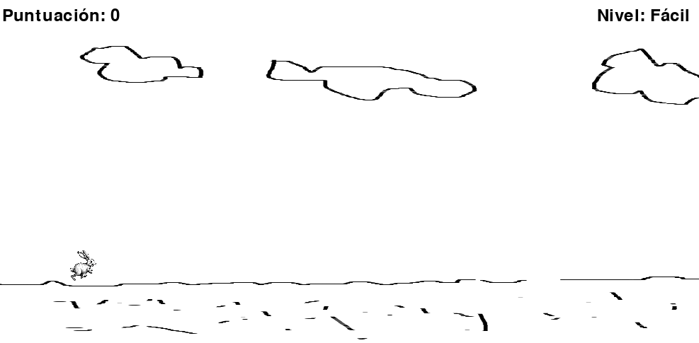
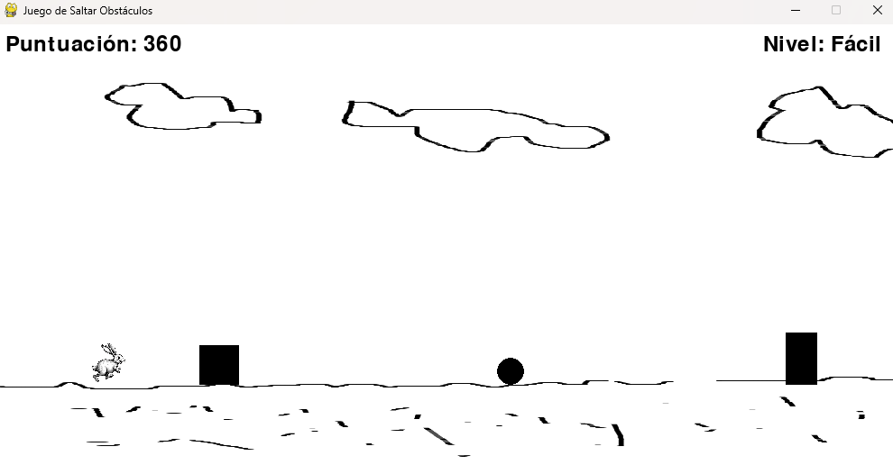
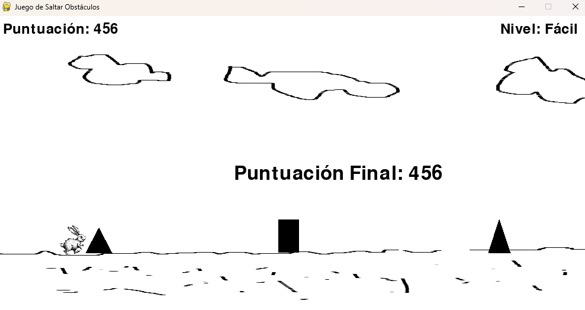

# Conejo Saltarín 🐇

## Descripción

**Conejo Saltarín** es un juego en 2D desarrollado en Python utilizando la biblioteca [Pygame](https://www.pygame.org/). En este juego, controlas a un conejo que debe saltar sobre obstáculos mientras acumula puntos. similar a dinosaur game

### Características Principales

- **Animación del Conejo:** El conejo alterna entre dos sprites para dar una apariencia animada mientras corre.
- **Generación de Obstáculos Aleatorios:** Los obstáculos se generan de forma aleatoria con una distancia variable entre ellos.
- **Detección de Colisiones:** Si el conejo choca con un obstáculo, el juego termina.
- **Niveles de Dificultad:** El juego ajusta la dificultad de los obstáculos según el progreso del jugador.
- **Puntuación en Pantalla:** El puntaje se actualiza en tiempo real durante el juego.

## Capturas de Pantalla

*Conejo saltando sobre un obstáculo.*

*Pantalla de fin de juego con la puntuación final.*

## Tecnologías Utilizadas

- **Lenguaje de Programación:** Python
- **Biblioteca Gráfica:** Pygame
- **Sistema Operativo:** windows 11

## Requisitos

- **Python 3.12.4** aunque funciona con anteriores.
- **Pygame** instalado.

### Clonar el Repositorio
    git clone https://github.com/moises60/conejo_saltarin_python.git

### Acceder a la Carpeta
    cd conejo_saltarin_python
    
### Ejecutar el Juego
    python3 main.py
